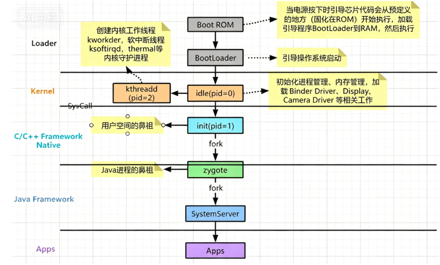

# 系统层

手机启动流程：boot rom(硬件上的固有程序)-->bootloader(引导操作系统启动)

## AMS

AMS 是 Android 系统核心服务之一，运行在 system_server 进程，属于 Framework 层核心服务。
它的本质是：系统所有四大组件、进程、内存、任务栈的统一管理者与调度中心。

1. Activity 管理
   1. 维护 Activity 生命周期
      - 决定何时调用：onCreate / onStart / onResume / onPause / onStop / onDestroy
      - 协调前后台切换、页面跳转、锁屏、退后台等场景。
   2. 任务栈（Task）与回退栈管理
      - 维护 TaskRecord、ActivityStack、ActivityRecord 结构。
      - 根据 launchMode、Intent Flag、taskAffinity 决定：
        - 新建 Activity
        - 复用已有 Activity
        - 清空栈、切换栈、置顶栈
   3. 焦点 Activity 管理
      - 系统哪个界面在最前端、哪个获取焦点，由 AMS 统一记录。
2. 四大组件的启动与调度
3. 应用进程管理（超级重要）
4. 权限与安全检查
5. ANR 监控与处理
6. 系统全局状态管理
7. 与其他系统服务协作

## WMS

1. 启动流程：

###

## PMS

# 应用层

## service

启动流程：
