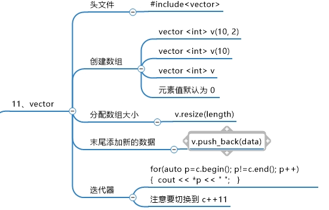

# c++入门

## 基础示例

```c++
#include<iostream>
using namespace std;//std是库，内涵cin，cout
int main()
{
    int a;
    cin>>a;
    cout<<a<<endl;
    //cin和cout时间效率不如scanf和printf
    return 0;
}
```

1. const->表示常量，等价于#define MAX 100

- 通常 const 用的多，define 没有类型，可能出错，更适合类似 Π，e 这种常量。这叫宏替换。

```c++
const int MAX=100;
```

2. 结构体
   和 c 差不多，只是不需要 typedef 就可以直接用名字。如：
   struct a{
   string name;
   int id;
   }
   in mian(){
   a.
   }
3. 引用&

```c
#include <iostream>
using namespace std;
void c(int *a ){
	*a++;
}
int main() {
	int n=3;
	c(&n);
	cout<<n;
}

```

```c++
#include <iostream>
using namespace std;
void c(int &a ){
	a++;
}
int main() {
	int n=3;
	c(n);
	cout<<n;
}

```

效果相同

### 1. string

```c++
string s="hello";
string s1=" world!";
string s2=s1+s;
//此时s2=holle world!
cout<<s.length()<<endl;
//s.length()即为s的长度
string s2_sub=s2.substr(1,2);
//从s2下标为1的元素开始取2个元素作为s2_sub的元素，此处为el
//(空格也会被记录)
string s2_sub2=s2.substr(6);
//从第6个开始后面的全部copy

```

- **空格也可以输入进 string**

##### string 的函数

**1.substr 函数用于提取字符串的子串**

```c++
#include <iostream>
#include <string>

using namespace std;
int main() {
  string a = "00012345";
  a = a.substr(a.find_first_not_of('0'));
  cout << "After removing leading zeros: " << a << endl;
  return 0;
}

//此处是找到了第一个非零字符的位置，然后 substr 函数提取了从该位置开始到字符串末尾的子串
```

**2.reverse 用于翻转整个内容**

- 要用 algorithm 函数

```c++
#include <algorithm>

    reverse(str.begin(), str.end());
```

**3.append 向字符串末尾添加字符**

```c++
#include <string>

    str.append(" World");
```

## stl 篇

### 容器

####容器的普遍性质

- 容器的遍历
  for (char& ch: s) （-s-容器的名字）是 C++11 引入的范围（range-based）for 循环，用于遍历容器类（比如字符串、数组、容器等）的元素。

## 1.vector——动态数组



- 基本概念
  vector 是动态数组
  内部元素默认值为 0
  vector 用法
  - v.size 是数组 v 的长度类似于在 string 中的 length。
  - 不论是一维数组还是二维都可以直接用名字让两个数组相等

```c++
#include<iostream>
#include<vector>
using namespace std;
int main(){
    vector <int> v;//空数组长度为0，没用
    //对于二维数组则有
    vector<vector<int>> v;

    //初始化：
    int rows=3;
	int cols=3;
	vector<vector<int>> attack(rows, vector<int>(cols, 0));

    //分配10个空间
    v.resize(10);

    for(int i;i<10;i++>){
        v[i]=i;
    }
    //此时的v为0123456789

    //尾部添加新的元素
    v.push_back(10);
    //v为0 1 2 3 4 5 6 7 8 9 10

    //创建方法2
    vector <int> v1(10,2);
    //10个空间，每个都是2
    //迭代器--即遍历循环
    for (auto p = v.begin();p!=v．end(); p++ ）
    //二维
    for (auto p = attack.begin(); p != attack.end(); p++) {
        	// 遍历每个内部 vector
        	for (auto q = p->begin(); q != p->end(); q++) {
            cout << *q << " ";  // 输出元素
        }
       	cout << endl;  // 输出换行以分隔每个内部 vector
    }
    cout<<*p<<" ";

    //更简单的方法
    for (const auto& row : attack) {
        for (const auto& val : row) {
            cout << val << " ";
        }
        cout << endl;
    }
外层循环 (for (const auto& row : attack)):
attack 是一个 vector<vector<int>>，即一个二维向量。
const auto& row 表示对 attack 中每个元素（每个 vector<int>）的引用，
避免复制。使用 const 可以确保不会意外修改 row。
这个循环会遍历 attack 中的每一行，每一行都是一个 vector<int>。
}
```


- erase 用法：

  ```c++
  vector<int> vec = {1, 2, 3, 4, 5};
  vec.erase(n);//删除的是n的值

  vec.erase(vec.begin() + 2); // 删除第三个元素（值为3）

  vec.erase(vec.begin() + 1, vec.begin() + 3); // 删除第二到第三个元素（值为2和3）

  str.erase (10,8);//从第10个数开始，往后的8个数
  ```

- find:
  需要头文件 algorithm
  ```c++
  #include<algorithm>
  auto t=find(vec.begin,vec.end,4)//查找数值为4的索引
  ```

## 2. set ——集合

- 集合内每个元素应该不同
  

```c++
#include <iostream>
#include <set>
using namespace std;
//创建
set<int>s;
//插入
s.insert(1);
s.insert(3);
s.insert(-3);
s.insert(99);
//遍历
for(auto p=s.begin();p!=s.end();p++)
{
    cout<<*p;
//删除
s.erase(1);
//查找
s.count(3);
}
```


##3. map——键值对


```c++
#include <iostream>
#include <map>
using namespace std;
int main(){
//创建
map<string, int>m;
//插入
m["holle"]=2;
m["world"]=4;
//遍历
for(auto p=m.begin();p<m.end();p++)
cont<<p->first<<":"<<p->second<<endl;
return 0;
}
```

### 3.list 双向链表

- 主要特性是可以随时插入
- 此处是 bfs 记录路径的难点
  
