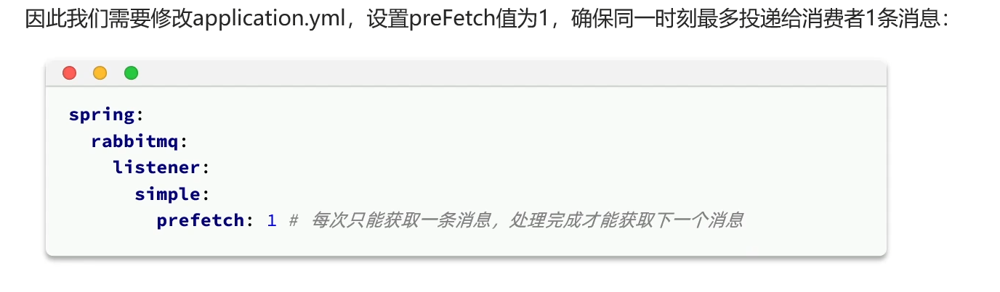

# 基础用法

## 添加 mq

···
docker run ^
-e RABBITMQ_DEFAULT_USER=root ^
-e RABBITMQ_DEFAULT_PASS=123456 ^
-v mq-plugins:/plugins ^
--name mq ^
--hostname mq ^
-p 15672:15672 ^
-p 5672:5672 ^
-d ^
rabbitmq:3.8-management
···

## 消费

- 不使用交换机，直接把消息发送到队列
  对于同一个队列的消息，只能被消费一次，若有多个消费者默认轮询，平均分配
  解决方法：
  
  多个消费者可以解决消息堆积的问题

## 交换机

1. fanout 广播交换机
