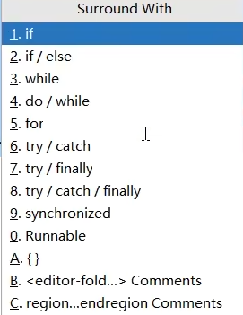

## idea 快捷键

1. ctrl+alt+t:快捷选择 if/else 或其他
   

## 面向对象编程的三大特性

封装、继承、多态

### 封装

隐藏内容，你只需会用

### 继承

类继承类，或类实现接口

### 多态

1. 方法重载是多态的一种
2. 方法覆盖：子类重写父类
   - 返回类型与父类一致
   - 子类修饰符不能比父类严格。比如父类 public 子类就不能 protected 或者 private
   - 抛出的异常不能更宽泛

## 基础数据类型

1. byte
2. short
3. int
4. long
5. float
6. double
7. char
8. boolean

### 包装类

| 基本数据类型 | 对应的包装类 | 说明                                                                                                   |
| ------------ | ------------ | ------------------------------------------------------------------------------------------------------ |
| `byte`       | `Byte`       | 用于包装 8 位有符号整数类型。`Byte`类提供了一些方法，比如将字符串转换为`byte`值的`parseByte`方法等 。  |
| `short`      | `Short`      | 包装 16 位有符号整数类型，支持类型转换、比较等操作。                                                   |
| `int`        | `Integer`    | 包装 32 位有符号整数类型，是使用频率较高的包装类之一，例如在集合中存储整数元素时常用到。               |
| `long`       | `Long`       | 包装 64 位有符号整数类型，适用于需要表示较大范围整数的场景。                                           |
| `float`      | `Float`      | 包装单精度 32 位浮点数类型，包含了一些与浮点数运算、转换相关的方法。                                   |
| `double`     | `Double`     | 包装双精度 64 位浮点数类型，用于表示精度要求较高的小数数值。                                           |
| `char`       | `Character`  | 包装字符类型，`Character`类提供了很多用于处理字符的方法，比如判断字符是否为字母、数字，大小写转换等 。 |
| `boolean`    | `Boolean`    | 包装布尔类型，用于将布尔值作为对象进行处理，在一些需要对象的编程场景中使用。                           |

## 数组与链表

1. 原生数组

   ```java
    // 整数数组
    int[] intArray = new int[5]; // 声明并分配空间（默认值为 0）
    int[] numbers = {1, 2, 3, 4, 5}; // 直接初始化

    // 字符数组
    char[] charArray = {'a', 'b', 'c'};

    // 布尔数组（默认值为 false）
    boolean[] flags = new boolean[3];
   ```

2. List 中的 ArrayList 和 linkedlist（java 中没有自带的单链表）
   区别：

   - ArrayList 类似于 vector，基于动态数组
   - LinkedList 是双向链表实现。适合中间插入，访问效率低

   共同点：

   - 非线程安全

# Hashmap 与 concurrenthashmap

- hashmap:
  1. 取模决定位置
  2. 达到容量的 75%后触发扩容，初始容量为 16(容量就是初始数组的长度)
     当链表长度超过 8 且数组容量 < 64 时，不会直接转红黑树，而是先触发扩容
  3. 红黑树转化：当链表长度达到 8 ，且同时满足数组容量 ≥ 64 。
  4. 退化：当红黑树中的元素个数减少到 6 时，会退化回链表
- concurrenthashmap
  1. 用 CAS 和 synchronized。只在改时锁住当前要操作的
  2. hasttable 是个被淘汰的老东西，他把所有线程都用 synchronized 锁起来

# io 流

1. 序列化
2. websocket 就会用到：

   ```Java
   try (ServerSocket serverSocket = new ServerSocket(8080);
      Socket socket = serverSocket.accept();
      InputStream in = socket.getInputStream();
      BufferedReader reader = new BufferedReader(new InputStreamReader(in))) {

      String data = reader.readLine(); // 读取客户端发送的文本数据
      System.out.println("收到数据：" + data);
      } catch (IOException e) {
       e.printStackTrace();
   }
   ```

# ==和 equals

==对比的是基本数据类型。或者内存地址是否相同
