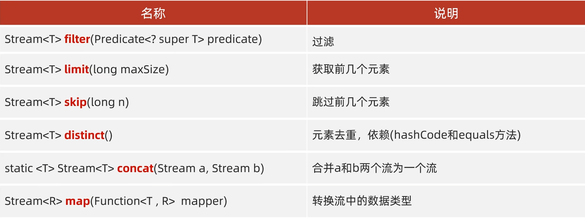

## 计算机基础

1. btye=8bit

## idea 快捷键

2. bit 位；只能表示 0 或 1

1. ctrl+alt+t:快捷选择 if/else 或其他
   

## 面向对象编程的三大特性

封装、继承、多态

### 封装

隐藏内容，你只需会用

### 继承

类继承类，或类实现接口

### 多态

1. 方法重载是多态的一种
2. 方法覆盖：子类重写父类
   - 返回类型与父类一致
   - 子类修饰符不能比父类严格。比如父类 public 子类就不能 protected 或者 private
   - 抛出的异常不能更宽泛

## 基础数据类型

1. byte
2. short
3. int
4. long
5. float
6. double
7. char
8. boolean
   基础类型的缺点
9. Java 集合（如 ArrayList、HashMap 等）只能存储对象，不能直接存储基本类型
10. 泛型不能用基础类型
11. 表示 null 值

### 包装类

| 基本数据类型 | 对应的包装类 | 说明                                                                                                   |
| ------------ | ------------ | ------------------------------------------------------------------------------------------------------ |
| `byte`       | `Byte`       | 用于包装 8 位有符号整数类型。`Byte`类提供了一些方法，比如将字符串转换为`byte`值的`parseByte`方法等 。  |
| `short`      | `Short`      | 包装 16 位有符号整数类型，支持类型转换、比较等操作。                                                   |
| `int`        | `Integer`    | 包装 32 位有符号整数类型，是使用频率较高的包装类之一，例如在集合中存储整数元素时常用到。               |
| `long`       | `Long`       | 包装 64 位有符号整数类型，适用于需要表示较大范围整数的场景。                                           |
| `float`      | `Float`      | 包装单精度 32 位浮点数类型，包含了一些与浮点数运算、转换相关的方法。                                   |
| `double`     | `Double`     | 包装双精度 64 位浮点数类型，用于表示精度要求较高的小数数值。                                           |
| `char`       | `Character`  | 包装字符类型，`Character`类提供了很多用于处理字符的方法，比如判断字符是否为字母、数字，大小写转换等 。 |
| `boolean`    | `Boolean`    | 包装布尔类型，用于将布尔值作为对象进行处理，在一些需要对象的编程场景中使用。                           |

integer 方法：

1.

## String，StringBuilder,StringBuffer

- String:不可变类型，底层用的 private final char[] value(jdk8),private final byte(jdk9,更节省内存),频繁修改会创建大量临时对象,导致内存浪费和 GC 压力
  char 是 16 位，byte 是 8 位。对于列如只占一个字符的英语单词 a，byte 更省空间

  - 方法：
    1.  split 分割
        ```java
          String a="2025-10-29";
          String[] arr = a.split("-");
          //arr[0]=2025,arr[1]=10,arr[2]=29
        ```

- StringBuilder:
  1. Integer.parseInt(String s)：String 转 int
  2. Integer.valueOf : String 转 integer

| 类       | String                                | StringBuilder                | StringBuffer                   |
| -------- | ------------------------------------- | ---------------------------- | ------------------------------ |
| 可变性   | 不可变（底层 char 数组被 final 修饰） | 可变（动态扩容的 char 数组） | 可变（动态扩容的 char 数组）   |
| 线程安全 | 安全（不可变天然线程安全）            | 不安全（无同步锁）           | 安全（方法加 synchronized 锁） |
| 性能     | 低（拼接会创建新对象）                | 高（单线程首选）             | 中（多线程场景）               |

## final、static、volatile 关键字

- static:修饰静态。“属于类” 的修饰符，可修饰   类、方法、变量、代码块，表示 “与类绑定，而非实例”(JVM 中类加载器中加载)
  - 实现方法的具体实现就叫实例，比如张三.吃饭，张三就是实例。吃饭是方法。student 是类。
- final:“不可变” 的修饰符。
  - 修饰类：类不能被继承（如  String、Integer），避免子类扩展破坏原逻辑。
  - 修饰方法：方法不能被重写，确保父类方法逻辑不被篡改（如工具类的核心方法）。
  - 修饰变量：
    - 基本类型变量：值不能修改（如  final int a = 10; a = 20; // 编译报错）；
    - 引用类型变量：引用不能指向新对象（但对象内部属性可修改）
- volatile 关键字：“可见性” 和 “禁止重排序” 的保证
  作用是解决多线程下的内存可见性和指令重排序问题：
  - 内存可见性：当一个线程修改  volatile  变量后，其他线程能 “立刻看到” 最新值（避免线程读取到本地缓存的旧值）；
  - 禁止指令重排序：阻止 JVM 对  volatile  变量相关的指令进行优化重排（如避免 “双重检查单例” 中的空指针问题）。
  - volatile 不能保证原子性

## 数组与链表

1. 原生数组

   ```java
    // 整数数组
    int[] intArray = new int[5]; // 声明并分配空间（默认值为 0）
    int[] numbers = {1, 2, 3, 4, 5}; // 直接初始化

    // 字符数组
    char[] charArray = {'a', 'b', 'c'};

    // 布尔数组（默认值为 false）
    boolean[] flags = new boolean[3];
   ```

2. List 中的 ArrayList 和 linkedlist（java 中没有自带的单链表）
   区别：

   - ArrayList 类似于 vector，基于动态数组

     - 方法

   - LinkedList 是双向链表实现。适合中间插入，访问效率低

   共同点：

   - 非线程安全
   -

## 接口

## Hashmap 与 concurrenthashmap

- hashmap:
  1. 取模决定位置
  2. 达到容量的 75%后触发扩容，初始容量为 16(容量就是初始数组的长度)
     当链表长度超过 8 且数组容量 < 64 时，不会直接转红黑树，而是先触发扩容
  3. 红黑树转化：当链表长度达到 8 ，且同时满足数组容量 ≥ 64 。
  4. 退化：当红黑树中的元素个数减少到 6 时，会退化回链表
     &nbsp;
  - 基础用法：
  1.  put(key,value):添加键值对。若键已存在，覆盖旧值并返回旧值；若键不存在，返回 null。
  2.  void putAll(Map):批量添加另一个 Map 中的所有键值对（键重复时覆盖）。
  3.  get(key):根据键获取对应的值，若键不存在返回 null。
- concurrenthashmap
  1. 用 CAS 和 synchronized。只在改时锁住当前要操作的
  2. hasttable 是个被淘汰的老东西，他把所有线程都用 synchronized 锁起来

## io 流

1. 序列化
2. websocket 就会用到：

   ```Java
   try (ServerSocket serverSocket = new ServerSocket(8080);
      Socket socket = serverSocket.accept();
      InputStream in = socket.getInputStream();
      BufferedReader reader = new BufferedReader(new InputStreamReader(in))) {

      String data = reader.readLine(); // 读取客户端发送的文本数据
      System.out.println("收到数据：" + data);
      } catch (IOException e) {
       e.printStackTrace();
   }
   ```

## 匿名内部类

匿名内部类的特点：

1. 没有类名：直接通过父类或接口来定义，无需显式声明类名。
2. 只能创建一个实例：匿名内部类在定义的同时就会创建唯一的实例，无法重复使用。
3. 必须继承一个父类或实现一个接口：不能独立存在，要么继承某个类，要么实现某个接口（且只能继承一个类或实现一个接口）。
4. 语法简洁：适合快速创建简单的类实例，避免单独定义一个类的繁琐。

语法格式：

```java
// 继承父类的匿名内部类
父类类型 变量名 = new 父类类型() {
    // 匿名内部类的成员（方法重写或新增）
};

// 实现接口的匿名内部类
接口类型 变量名 = new 接口类型() {
    // 实现接口的抽象方法
};
```

实现接口的匿名内部类:

```java
// 定义一个接口
interface Greeting {
    void sayHello();
}

public class AnonymousDemo {
    public static void main(String[] args) {
        // 创建匿名内部类，实现Greeting接口
        Greeting greeting = new Greeting() {
            @Override
            public void sayHello() {
                System.out.println("Hello, 匿名内部类！");
            }
        };
        greeting.sayHello(); // 输出：Hello, 匿名内部类！
    }
}
```

## stream 流

1. stream 流的中间方法
   
   - 中间方法返回新的 stream 流，前面的 stream 只能使用一次，用过一次后就没了，建议链式编程
   - 修改 stream 流中的数据不会影响原数据
   - 举例：
     1. filter
     ```java
     //Predicate是java内置方法，接收一个参数返回bool类型，filter强绑predicate方法
       list.stream().filter(new Predicate<String>() {
          @Override
          public boolean test(String s) {
              if(s.endsWith("子")){
                  return true;
              }
              return false;
          }
      }).forEach(s-> System.out.println(s));
     ```
     2. distinct 底层用 hashset

## == 和 equals

== 对比的是基本数据类型。或者内存地址是否相同

## jdk,jre,jvm

1. jdk：Java 开发工具包，是开发的必须环境，包含开发 Java 程序所需的工具（如 javac 编译器、jdb 调试器）。
2. JRE (Java Runtime Environment)：Java 运行时环境，包含 JVM 和运行 Java 程序所需的核心类库（如 rt.jar）。仅需运行 Java 程序时安装。
3. JVM (Java Virtual Machine)：Java 虚拟机，负责将字节码（.class 文件）解释 / 编译为本地机器码并执行，是 “一次编译，到处运行” 的核心。
   关系：JDK ⊇ JRE ⊇ JVM（JDK 包含 JRE，JRE 包含 JVM 和类库）
