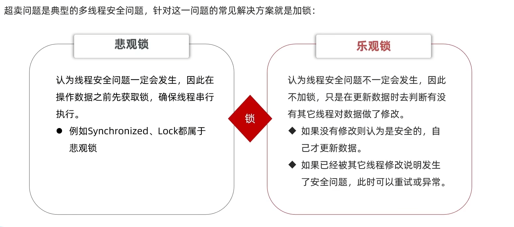

# session,cookie,token,threadlocal

## session

1. session 存在服务器中，默认存在服务器内存
2. sessionid 存在浏览器的 cookie 中，用于指定这个 session 是哪个用户的
3. threadlocal 是每个线程都有一个 Threadlocals。

## 为什么要把 session 存在 threadlocal 里？

因为每次查询 session 都要先在浏览器中拿 id，在去服务器找，很慢。所以直接在拦截器中把 session 存在 threadlocal 里

# Http

1. HttpServletRequest：是前端发来的请求，通过它能获取 HTTP 请求头里的各种字段
2. HttpServletResponse：后端响应给前端的

# 锁

1. 乐观锁
   - cas 锁
     - 在修改数据时，同时判断库存有没有被修改。很容易导致其他失败，所以可以改成判断数据库里的数据大于 0 即可。
