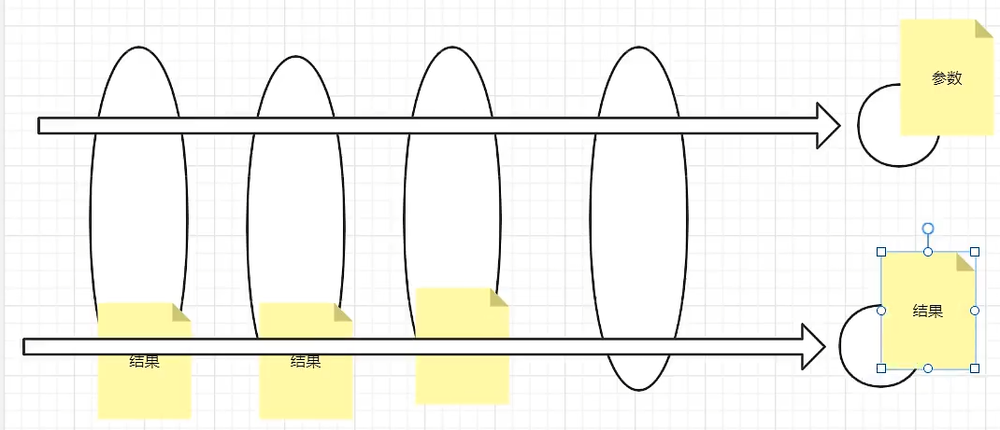
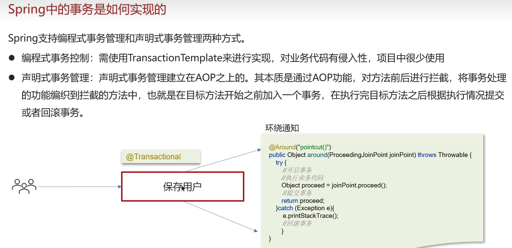

# session,cookie,token,threadlocal

## session

1. session 存在服务器中，默认存在服务器内存
2. sessionid 存在浏览器的 cookie 中，用于指定这个 session 是哪个用户的
3. threadlocal 是每个线程都有一个 Threadlocals。

## 为什么要把 session 存在 threadlocal 里？

因为每次查询 session 都要先在浏览器中拿 id，在去服务器找，很慢。所以直接在拦截器中把 session 存在 threadlocal 里

# Http

1. HttpServletRequest：是前端发来的请求，通过它能获取 HTTP 请求头里的各种字段
2. HttpServletResponse：后端响应给前端的

# 锁


1. 乐观锁
   - cas 锁
     - 在修改数据时，同时判断库存有没有被修改。很容易导致其他失败，所以可以改成判断数据库里的数据大于 0 即可。

# 三级缓存，spring 循环依赖

为什么要用三级，利于 aop

# stream 流

# 大文件上传

前端分段上传，用 oss 可以自动帮你切片上传

# ioc 控制反转

- 为什么叫控制反转？
  因为本来创建对象是由开发者创建，但是在 spring 里，他帮你统一创建了对象。这样每次复用的时候就不用重新创建了，减少性能开销

# AOP 面向切面编程

把不影响业务的（重复）代码抽离出来


# spring

# spring 注解

1. component 和 service，controller，Repository：实际作用是一样的

## bean

1. spring 中的单例 bean 是线程安全的吗？
   答：不是。如果有设置变量就不安全。
   因为一般在 spring 的 bean 的中都是注入无状态的对象，没有线程安全问题，如果在 bean 中定义了可修改的成员变量，是要考虑线程安全问题的，可以使用多例或者加锁来解决

# 事务

## 事务失效

如果目标程序自己处理了异常，没有抛出，事务就会失效

## 声明式事务就是基于 AOP



# TCP 与 UDP

1. TCP

- 握手
  1. 客户端告诉服务器，我要连接了
  2. 服务端回应客户端，我收到了
  3. 客户端回应服务端，我收到了
- 挥手


    1. 客户端告诉服务端分手
    2. 服务端回应知道，并等待数据处理完成
    3. 服务端数据处理完成后，告诉客户端可以断开了
    4. 客户端告诉服务端，我已明白，并断开，服务端收到后也断开

# Http

1. 无状态，因此请求头要带上 cookie

# 错误与异常

1. Checked Exception

   ```java
   // 提供详细的异常信息
    public class PaymentException extends Exception {
      public PaymentException(String message, String transactionId) {
        super(message + " [交易ID: " + transactionId + "]");
      }
    }

    // 使用异常链保留根本原因
    try {
        processPayment();
    } catch (SQLException e) {
        throw new PaymentException("支付处理失败", e);
    }
   ```

2. Unchecked Exception

```Java
  // 快速失败，尽早暴露问题
   public class ValidationUtil {
      public static void notNull(Object obj, String message) {
           if (obj == null) {
              throw new IllegalArgumentException(message);
         }
      }
 }

 // 在业务层使用
 @Service
 public class OrderService {
     public void createOrder(Order order) {
         ValidationUtil.notNull(order, "订单不能为null");
         ValidationUtil.notNull(order.getUser(), "用户信息不能为空");
         // 业务逻辑...
     }
 }
```
