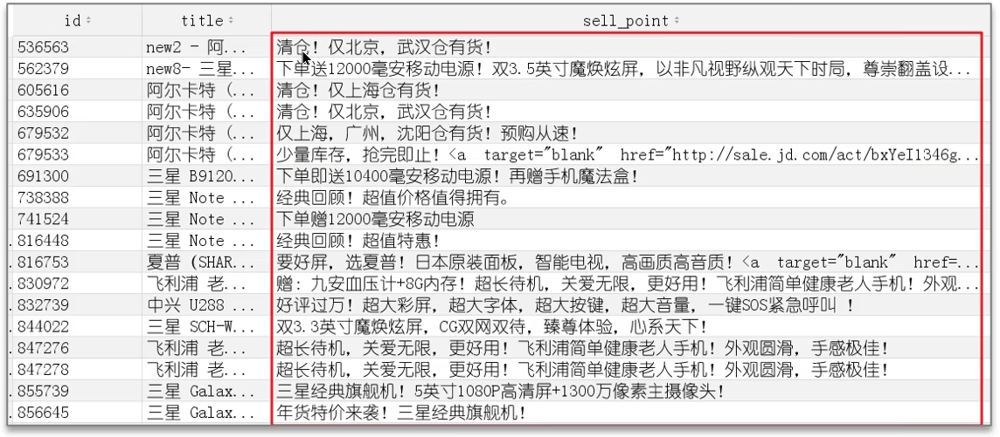
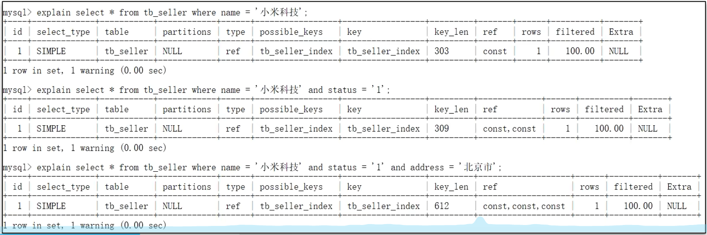

# redis

1. 缓存击穿
   - 一个数据刚好在 redis 里过期时大量的请求打过来
     - 加互斥锁，redis 里用 setnx，只创建不存在的值。一定要添加过期时间，防止死锁，属于悲观锁，效率低，串行运行
     - 使用逻辑过期，永远都查得到值，过期前查正确值。过期的一瞬间后查的是旧值，同时在新的线程里修改值。
2. 缓存穿透
   - 查询一个不存在的数据，导致一直访问数据库
     - 缓存空值
     - 布隆过滤器
       
       对数据运算为数字，然后 hash 取余操作，结果处的值改为一。
     - 提前预判部分不存在的数据
3. 缓存雪崩
   - 大量数据同时过期
     - 随机过期
     - 如果是 redis 宕机可以集群模式，哨兵模式

## 基础语法

1. 运算
   1. incrby key -1:给 key 的值减一
2. 集合
   1. sadd key value 向集合 key 里加入值 value，没有集合 key 则创建
   2. sismember key value 检测集合 key 里有没有 value

## redis 事务与 lua 脚本

redis 事务拿不到中间值

## 秒杀

可能存在的问题：

1. 多线程并发，导致超卖
2. 不限制用户 id，一人抢多单
3. redis 分布式锁误删（线程 1 阻塞导致锁过期，线程 2 上锁，线程 1 阻塞结束，把线程 2 的锁删除）

## 如何保证 redis 和数据库里的数据一致？

- 先删数据库再删缓存还是相反？
  1. 先删数据库
     如果缓存正好过期，线程一访问数据库，拿到结果 10.线程二插入，删掉数据库值，改为 20，再删缓存。线程一拿到的是 10，存入缓存。结果不一致
  2. 先删缓存
     易得：依旧不一致问题
- 解决方法
  1. 延迟双删（一致性一般）
     先删缓存--->数据库（延迟）--->缓存
  2. 加锁（强一致性要求）
     1. 共享锁与排它锁---读锁与写锁
        
  3. 加中间层如 mq（异步，有延迟）

## redis 持久化

### RDB

全称 redis Database Backup file

1. 主动备份

   - save 主进程运行，堵塞其他命令
   - bgsave 子进程，不堵塞

2. 自动备份（可再 redis.conf 中修改配置）
   
   子进程即为备份进程，为了避免数据不一致。进行备份时物理内存中的数据为只读模式，写操作会让数据复制副本，主进程对副本操作与读写
3.

### AOF（Append Only File）


AOF 默认关闭，在 conf 文件里开启
触发方式：

1. 每条命令都触发写入-appendfsync always
2. 先缓存命令，每秒写入一次到 AOF-appendfsync everysec
3. 先缓存，由操作系统决定写入 AOF-appendfsync no

## redis 过期策略

1. 惰性删除：在使用 key 时进行检测，过期则删除。
   - 优点：对 cpu 友好
   - 缺点：对内存不友好
2. 定期删除：每隔一段时间抽取随机 key 检测
   1. slow 模式：默认频率 10hz，每次执行时间少于 25ms。频率可修改
   2. fast 模式：频率不固定，间隔不低于 2ms，耗时不超过 1ms

## redis 数据淘汰策略

1. noeviction:默认策略，不淘汰任何数据，内存满了新数据无法写入
1. lru:最近最少使用


# MySQL

## 底层结构

### 对于单张页


对于一张表中，新加入的的数据如果是按 id 排序并不会每次加入后都进行排序，而是用 next_record 存下一个数据的地址，每次加数据只需要改这个

- next_record：下一个数据的地址，针对于本页内。永远是从 0 开始
- page_new_infimum: 链表中的第一条数据
- page_new_supremum:链表中的最后一个数据
- heap_no:自带的自增 id
- 从磁盘取数据一次取 16kb 数据，即一页的大小（MySQL 的页大小默认是 16KB）
  第一张表是目录表，标记了 idx 到 xx 的数据所在的页面

### 对于多张表


（两张图连一起看）
开头加一行内容显示下一页的位置，用 next_page\*16kb
最后一张才是头文件，第几张的 id 范围都已确定，方便查询

可以视为


## 索引

所有索引（包括聚簇索引和非聚簇索引）都采用 B+ 树 结构

- 聚簇索引（主键索引）：叶子节点直接存储「完整的数据行」，数据的物理存储顺序与索引键（主键）的逻辑顺序一致。
- 非聚簇索引（如普通索引、唯一索引）：叶子节点存储「索引键 + 聚簇索引键（主键）」，不存储完整数据行。

1. 聚簇索引（也叫聚集索引）：一般就是主键
2. 非聚簇索引（二级索引）：其他键

- 覆盖索引：是指查询使用了索引，并且需要返回的列，在该索引中已经全部能够找到。
  ```mysql
  select * from tb_user where id = 1                       #true
  select id,name from tb_user where name =* 'Arm'          #true
  select id,name，gender from tb_user where name = 'Arm'   #false
  ```
  非聚簇索引对应的表有主键和自己

### 创建索引

```
CREATE INDEX idx_student_age ON students (age);  # 给age创建索引
CREATE INDEX index_name ON table_name (column1, column2, ...);  # 组合索引
```

创建索引的原则：

1. 针对于数据量较大，且查询比较频繁的表建立索引。单表超过 10 万数据
2. 针对于常作为查询条件(where)、排序(order by)、分组(group by)操作的字段建立索引。
3. 尽量选择区分度高的列作为索引，尽量建立唯一索引，区分度越高，使用索引的效率越高。
4. 如果是字符串类型的字段，字段的长度较长，可以针对于字段的特点，建立前缀索引。

   

5. 尽量使用联合索引，减少单列索引，查询时，联合索引很多时候可以覆盖索引，节省存储空间，避免回表，提高查询效率。
6. 要控制索引的数量，索引并不是多多益善，索引越多，维护索引结构的代价也就越大，会影响增删改的效率。
7. 如果索引列不能存储 NULL 值，请在创建表时使用 NOTNJLL 约束它。当优化器知道每列是否包含 NULL 值时，它可以更好地确定哪个索引最有效地用于查询。

### 索引失效

索引失效后会改成用聚簇索引查询，但是聚簇索引也会失效，失效后改全盘扫描

#### 聚簇索引失效

1. 使用函数或表达式操作主键字段
   ```mysql
      -- 主键id是INT类型，以下查询会导致索引失效
      SELECT * FROM table WHERE id + 1 = 100;
      SELECT * FROM table WHERE SUBSTR(id, 1, 1) = '1';
      # substr（a,b,c）提取字符串a中从第b位开始的后c位，不写c就是后全部。b最小为1
      SELECT * FROM table WHERE CAST(id AS CHAR) = '100';
   ```
2.

#### 非聚簇索引失效

1. 违反最左前缀法则
   - 对于聚合索引，只能从最左侧的索引开始查询，并且不能跳行。
     
     只有图中三种情况可以
     ```MySQL
     #  只能查出name
     explain select * from tb_seller where name = '小米科技’and address = '北京市’;
     ```
2. 范围查询右边的列，不能使用索引
   rgba(128, 183, 183, 1)
   ```MySQL
   rgba(88, 137, 137, 1)
   # address会失效
   select * from tb_seller where name ='小米' and status>'0' address='武汉'
   ```
3. 不要在索引列上进行运算操作，索引将失效字符串不加单引号，造成索引失效。(类型转换)
   ```mysql
   select * from tb_seller where substring (name,3,2) = '科技';
   ```
4. 以%开头的 Like 模糊查询，索引失效
   不是一定失效
   explain select sellerid, name from tb_seller where name like '黑马程序员%’;
   %在后失效，%在前成

## 基础

### 关键字

1.  数据查询
    SELECT：用于从表中查询数据
    FROM：指定查询的表
    WHERE：过滤查询条件
    GROUP BY：按列分组统计

    - 示例

      ```mysql
      SELECT
      user_id,
      COUNT(id) AS order_count,  -- 统计每组的订单数量
      SUM(amount) AS total_amount  -- 计算每组的总金额
      FROM orders
      GROUP BY user_id;
      ```

      结果：

      | user_id | order_count | total_amount |
      | ------- | ----------- | ------------ |
      | 100     | 3           | 900          |
      | 101     | 1           | 150          |

      不要 GROUP BY user_id 有什么影响？
      <e>
      答：不要会导致 id 和 order_count 统计的是全部的。并且 user_id 会是随机一条，或者报错
      &nbsp;

    HAVING：对分组结果进行过滤（类似 WHERE，但用于分组后）
    ORDER BY：对结果排序（ASC 升序、DESC 降序）
    LIMIT：限制返回结果的数量
    DISTINCT：去除重复值

2.  数据操作
    INSERT：插入数据到表中（配合 INTO 使用）
    UPDATE：更新表中的数据（配合 SET 和 WHERE）
    DELETE：删除表中的数据（配合 FROM 和 WHERE）
    VALUES：在 INSERT 中指定插入的值
    SET：在 UPDATE 中指定要修改的列和值
3.  表结构操作
    CREATE：创建数据库、表、索引等（如 CREATE TABLE）

    ALTER：修改表结构（如添加列 ALTER TABLE ... ADD）

    DROP：删除数据库、表、索引等（如 DROP TABLE）

    TRUNCATE：清空表中所有数据（保留表结构）

    RENAME：重命名表或数据库

4.  其他常用关键字
    AS：定义别名（如 SELECT name AS username）
    &nbsp;
    DISTINCT：去重且非 null（如 SELECT DISTINCT category，搜索不重复且不为 null 的 category）
    &nbsp;
    ALL：返回所有结果（默认，与 DISTINCT 相反）
    &nbsp;
    CASE：条件判断（类似编程语言中的 if-else，如 CASE WHEN ... THEN ... ELSE ... END）
    &nbsp;
    EXISTS：判断子查询是否返回结果（如 WHERE EXISTS (SELECT 1 FROM ...)）
    &nbsp;
    in:是一个用于条件判断的运算符，主要作用是判断某个值是否在指定的集合中

### 运算符

1. 基础运算符:+-\*/%
2. 比较运算符:=,!=,<,>
   - betwee...and...包含边界
   - in 在指定集合中（有相等的值才返回）
     SELECT \* FROM users WHERE status IN (1, 3, 5);
   - not in 不在集合中
   - is null 判断是否为空
   - like 模糊匹配
3. 逻辑运算符:and,or,not,xor(逻辑异或,两个条件一真一假时为真)
4. 位运算，和 c 一样
5. 其他: :=赋值（仅用于 SET 或 UPDATE） :=：赋值（可在查询中使用）

### 函数

- 聚合函数
  1. count()统计数量
     ```c++
     SELECT COUNT(*) FROM customers; -- 总记录数
     SELECT COUNT(DISTINCT email) FROM customers; -- 去重后的邮箱数
     ```
  2. sum(price)
  3. avg(age)
  4. max(hight)
- 日期函数

  1. DATE() / DATE_FORMAT()：日期提取与格式转换
     场景：将 datetime 类型转为 “年 - 月 - 日” 格式，适配报表展示。
     ```mysql
     SELECT DATE(order_time) AS order_date, DATE_FORMAT(order_time, '%Y-%m-%d %H:%i') AS fmt_time FROM orders;
     ```
  2. CURDATE() / NOW()：获取当前日期 / 当前日期时间
     场景：查询 “今天的订单”“当前时间之前的活动”。
     SELECT \* FROM orders WHERE DATE(order_time) = CURDATE();（查询今日订单）
  3. DATEDIFF()：计算两个日期的天数差
     场景：计算用户会员剩余天数、订单距今多久未支付。
     示例：SELECT DATEDIFF(expire_time, CURDATE()) AS remaining_days FROM user_members;

- 字符串函数(不常用)
  1. SUBSTRING() / LEFT() / RIGHT()：字符串截取
     场景：隐藏手机号中间 4 位（如 “138\*\*\*\*8000”）、提取身份证前 6 位（地区码）。
     示例：
     ```mysql
     SELECT CONCAT(LEFT(phone, 3),  '****', RIGHT(phone, 4)) AS hide_phone FROM users;
     ```

### 表的连接

1. join ：内连接，只返回 a,b 表同时符合条件的数据
   ```mysql
      select unique_id,name from Employees left join EmployeeUNI on EmployeeUNI.id=Employees.id
   ```
   只能用 on 不能用 where，其他函数可以
2. left join ：左外连接，返回左表所有数据，和右表满足条件的行。如果左表中的某行在右表中没有匹配到满足连接条件的记录，那么右表对应的列值会用 NULL 填充。
3. outer join ：全外连接，

### 案例

1. 子查询

   ```mysql
   select *
   from tb_sku t,
   (select id from tb_sku order by id limit 9000000,10) a
   where t.id = a. id;
   # 子查询必须要命名为a
   # 非主键查询一定要加order by不然默认物理顺序，修改数据后查询结果会变，主键索引也建议加

   ```

2. oo

   ```MySQL
   select name from{
     select count(managerId)
     from Employee
     where count >5
     group by managerId
   }

   ```

   这是错的，下面是对的：

   ```mysql
   -- 查询管理了超过5名员工的管理者姓名
   SELECT e.name
   FROM Employee e
   WHERE e.id IN (
    -- 子查询：找出管理人数 >5 的 managerId
    SELECT managerId
    FROM Employee
    GROUP BY managerId
    HAVING COUNT(managerId) > 5  -- 用 HAVING 过滤分组后的计数结果
   );

   ```

   如果按我的思路应该是这样的：

   ```mysql
   select Name
   from (
   select Manager.Name as Name, count(Report.Id) as cnt
   from
   Employee as Manager join Employee as Report
   on Manager.Id = Report.ManagerId
   group by Manager.Id
   ) as ReportCount
   where cnt >= 5
   ```

## 快慢查询

### 定位慢查询

当压力测试时，某个接口查询时间过长

1. 使用运维工具（skywalking）
2. 使用慢日志查询，设置例如两秒以上为慢的设定。查出慢语句

### 优化慢查询

- 使用 explain 命令
  EXPLAIN select \*from xxx
  !
  1. partitions 是否开启表分区
  2. select_type:查询类型
     - 这里是简单查询 simple
  3. type:表的扫描类型,效率从高到低排序如下:(后两个不建议使用)
     - NULL:使用时没用到表
     - system:用的 mysql 自带的表
     - const:根据主键查询(带 where 条件,只有一条记录)
     - eq_ref:唯一键或主键查询
     - ref:索引查询(非唯一索引)
     - range:范围查询
     - index:全索引查询,遍历整个索引树
     - all:全盘扫描,不走索引
