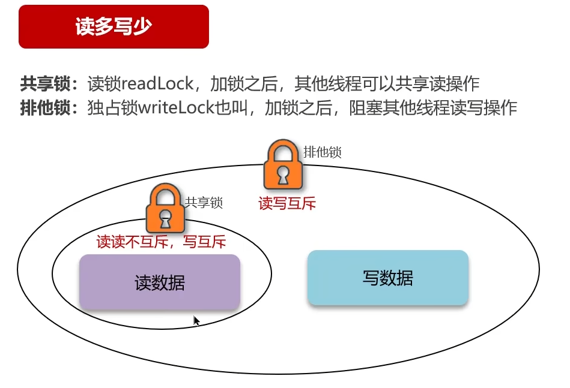
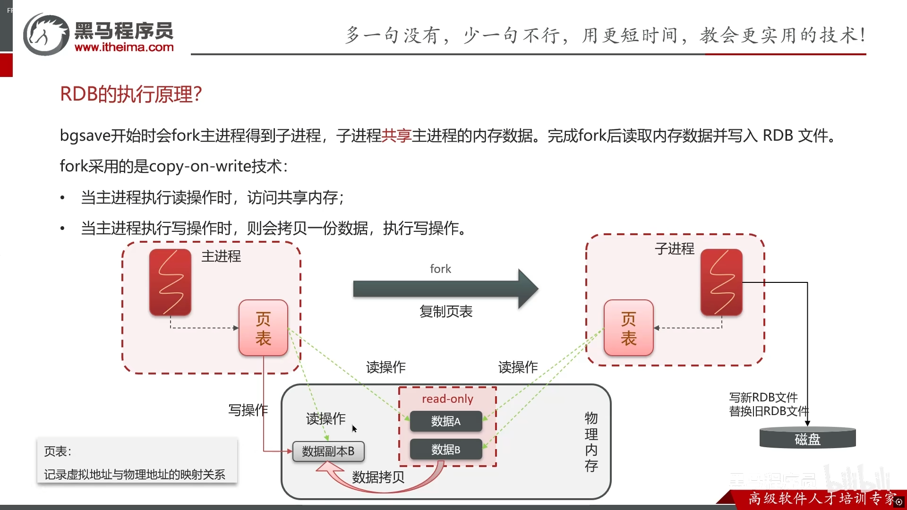
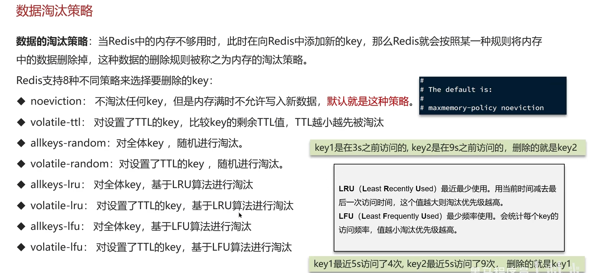

# redis

1. 缓存击穿
   - 一个数据刚好在 redis 里过期时大量的请求打过来
     - 加互拆锁，redis 里用 setnx，只创建不存在的值。一定要添加过期时间，防止死锁，属于悲观锁，效率低，串行运行
     - 使用逻辑过期，永远都查得到值，过期前查正确值。过期的一瞬间后查的是旧值，同时在新的线程里修改值。
2. 缓存穿透
   - 查询一个不存在的数据，导致一直访问数据库
     - 缓存空值
     - 布隆过滤器
       
       对数据运算为数字，让后 hash 取余操作，结果处的值改为一。
     - 提前预判部分不存在的数据
3. 缓存雪崩
   - 大量数据同时过期
     - 随机过期
     - 如果是 redis 宕机可以集群模式，哨兵模式

## redis 事务与 lua 脚本

redis 事务拿不到中间值

## 秒杀

可能存在的问题：

1. 多线程并发，导致超卖
2. 不限制用户 id，一人抢多单
3. redis 分布式锁误删（线程 1 阻塞导致锁过期，线程 2 上锁，线程 1 阻塞结束，把线程 2 的锁删除）

## 如何保证 redis 和数据库里的数据一致？

- 先删数据库在删缓存还是相反？
  1. 先删数据库
     如果缓存正好过期，线程一访问数据库，拿到结果 10.线程二插入，删掉数据库值，改为 20，再删缓存。线程一拿到的是 10，存入缓存。结果不一致
  2. 先删缓存
     易得：依旧不一致问题
- 解决方法
  1. 延迟双删（一致性一般）
     先删缓存--->数据库（延迟）--->缓存
  2. 加锁（强一致性要求）
     1. 共享锁与排它锁---读锁与写锁
        
  3. 加中间层如 mq（异步，有延迟）

## redies 持久化

### RDB

全称 redis Database Backup file

1. 主动备份

   - save 主进程运行，堵塞其他命令
   - bgsave 子进程，不堵塞

2. 自动备份（可再 redis.conf 中修改配置）
   
   子进程即为备份进程，为了避免数据不一致。进行备份时物理内存中的数据为只读模式，写操作会让数据复制副本，主进程对副本操作与读写
3.

### AOF（Append Only File）

AOF 默认关闭，在 conf 文件里开启
触发方式：

1. 每条命令都触发写入-appendfsync always
2. 先缓存命令，每秒写入一次到 AOF-appendfsync everysec
3. 先缓存，由操作系统决定写入 AOF-appendfsync no

## redis 过期策略

1. 惰性删除：在使用 key 时进行检测，过期则删除。
   - 优点：对 cpu 友好
   - 缺点：对内存不友好
2. 定期删除：每隔一段时间抽取随机 key 检测
   1. slow 模式：默认频率 10hz，每次执行时间少于 25ms。频率可修改
   2. fast 模式：频率不固定，间隔不低于 2ms，耗时不超过 1ms

## redis 数据淘汰策略

