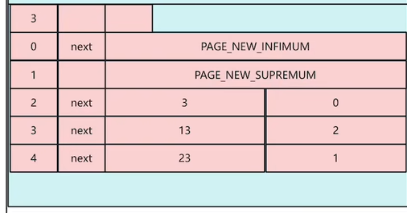

# redis

1. 缓存击穿
   - 一个数据刚好在 redis 里过期时大量的请求打过来
     - 加互斥锁，redis 里用 setnx，只创建不存在的值。一定要添加过期时间，防止死锁，属于悲观锁，效率低，串行运行
     - 使用逻辑过期，永远都查得到值，过期前查正确值。过期的一瞬间后查的是旧值，同时在新的线程里修改值。
2. 缓存穿透
   - 查询一个不存在的数据，导致一直访问数据库
     - 缓存空值
     - 布隆过滤器
       
       对数据运算为数字，然后 hash 取余操作，结果处的值改为一。
     - 提前预判部分不存在的数据
3. 缓存雪崩
   - 大量数据同时过期
     - 随机过期
     - 如果是 redis 宕机可以集群模式，哨兵模式

## 基础语法

1. 运算
   1. incrby key -1:给 key 的值减一
2. 集合
   1. sadd key value 向集合 key 里加入值 value，没有集合 key 则创建
   2. sismember key value 检测集合 key 里有没有 value

## redis 事务与 lua 脚本

redis 事务拿不到中间值

## 秒杀

可能存在的问题：

1. 多线程并发，导致超卖
2. 不限制用户 id，一人抢多单
3. redis 分布式锁误删（线程 1 阻塞导致锁过期，线程 2 上锁，线程 1 阻塞结束，把线程 2 的锁删除）

## 如何保证 redis 和数据库里的数据一致？

- 先删数据库再删缓存还是相反？
  1. 先删数据库
     如果缓存正好过期，线程一访问数据库，拿到结果 10.线程二插入，删掉数据库值，改为 20，再删缓存。线程一拿到的是 10，存入缓存。结果不一致
  2. 先删缓存
     易得：依旧不一致问题
- 解决方法
  1. 延迟双删（一致性一般）
     先删缓存--->数据库（延迟）--->缓存
  2. 加锁（强一致性要求）
     1. 共享锁与排它锁---读锁与写锁
        
  3. 加中间层如 mq（异步，有延迟）

## redis 持久化

### RDB

全称 redis Database Backup file

1. 主动备份

   - save 主进程运行，堵塞其他命令
   - bgsave 子进程，不堵塞

2. 自动备份（可再 redis.conf 中修改配置）
   
   子进程即为备份进程，为了避免数据不一致。进行备份时物理内存中的数据为只读模式，写操作会让数据复制副本，主进程对副本操作与读写
3.

### AOF（Append Only File）


AOF 默认关闭，在 conf 文件里开启
触发方式：

1. 每条命令都触发写入-appendfsync always
2. 先缓存命令，每秒写入一次到 AOF-appendfsync everysec
3. 先缓存，由操作系统决定写入 AOF-appendfsync no

## redis 过期策略

1. 惰性删除：在使用 key 时进行检测，过期则删除。
   - 优点：对 cpu 友好
   - 缺点：对内存不友好
2. 定期删除：每隔一段时间抽取随机 key 检测
   1. slow 模式：默认频率 10hz，每次执行时间少于 25ms。频率可修改
   2. fast 模式：频率不固定，间隔不低于 2ms，耗时不超过 1ms

## redis 数据淘汰策略


# MySQL

## 底层结构

### 对于单张页


对于一张表中，新加入的的数据如果是按 id 排序并不会每次加入后都进行排序，而是用 next_record 存下一个数据的地址，每次加数据只需要改这个

- next_record：下一个数据的地址，针对于本页内。永远是从 0 开始
- page_new_infimum: 链表中的第一条数据
- page_new_supremum:链表中的最后一个数据
- heap_no:自带的自增 id
- 从磁盘取数据一次取 16kb 数据，即一页的大小（MySQL 的页大小默认是 16KB）
  第一张表是目录表，标记了 idx 到 xx 的数据所在的页面

### 对于多张表



（两张图连一起看）
开头加一行内容显示下一页的位置，用 next_page\*16kb
最后一张才是头文件，第几张的 id 范围都已确定，方便查询

可以视为


## 基础

### 关键字

1. 数据查询
   SELECT：用于从表中查询数据
   FROM：指定查询的表
   WHERE：过滤查询条件
   GROUP BY：按列分组统计
   HAVING：对分组结果进行过滤（类似 WHERE，但用于分组后）
   ORDER BY：对结果排序（ASC 升序、DESC 降序）
   LIMIT：限制返回结果的数量
   DISTINCT：去除重复值
2. 数据操作
   INSERT：插入数据到表中（配合 INTO 使用）
   UPDATE：更新表中的数据（配合 SET 和 WHERE）
   DELETE：删除表中的数据（配合 FROM 和 WHERE）
   VALUES：在 INSERT 中指定插入的值
   SET：在 UPDATE 中指定要修改的列和值
3. 表结构操作
   CREATE：创建数据库、表、索引等（如 CREATE TABLE）
   ALTER：修改表结构（如添加列 ALTER TABLE ... ADD）
   DROP：删除数据库、表、索引等（如 DROP TABLE）
   TRUNCATE：清空表中所有数据（保留表结构）
   RENAME：重命名表或数据库
4. 其他常用关键字
   AS：定义别名（如 SELECT name AS username）
   DISTINCT：去重（如 SELECT DISTINCT category）
   ALL：返回所有结果（默认，与 DISTINCT 相反）
   CASE：条件判断（类似编程语言中的 if-else，如 CASE WHEN ... THEN ... ELSE ... END）
   EXISTS：判断子查询是否返回结果（如 WHERE EXISTS (SELECT 1 FROM ...)）

### 运算符

1. 基础运算符:+-\*/%
2. 比较运算符:=,!=,<,>
   - betwee...and...包含边界
   - in 在指定集合中（有相等的值才返回）
     SELECT \* FROM users WHERE status IN (1, 3, 5);
   - not in 不在集合中
   - is null 判断是否为空
   - like 模糊匹配
3. 逻辑运算符:and,or,not,xor(逻辑异或,两个条件一真一假时为真)
4. 位运算，和 c 一样
5. 其他: :=赋值（仅用于 SET 或 UPDATE） :=：赋值（可在查询中使用）

### 函数

- 聚合函数
  1. count()统计数量
     ```c++
     SELECT COUNT(*) FROM customers; -- 总记录数
     SELECT COUNT(DISTINCT email) FROM customers; -- 去重后的邮箱数
     ```
  2. sum(price)
  3. avg(age)
  4. max(hight)
- 日期函数

  1. DATE() / DATE_FORMAT()：日期提取与格式转换
     场景：将 datetime 类型转为 “年 - 月 - 日” 格式，适配报表展示。
     ```mysql
     SELECT DATE(order_time) AS order_date, DATE_FORMAT(order_time, '%Y-%m-%d %H:%i') AS fmt_time FROM orders;
     ```
  2. CURDATE() / NOW()：获取当前日期 / 当前日期时间
     场景：查询 “今天的订单”“当前时间之前的活动”。
     SELECT \* FROM orders WHERE DATE(order_time) = CURDATE();（查询今日订单）
  3. DATEDIFF()：计算两个日期的天数差
     场景：计算用户会员剩余天数、订单距今多久未支付。
     示例：SELECT DATEDIFF(expire_time, CURDATE()) AS remaining_days FROM user_members;

- 字符串函数(不常用)
  1. SUBSTRING() / LEFT() / RIGHT()：字符串截取
     场景：隐藏手机号中间 4 位（如 “138\*\*\*\*8000”）、提取身份证前 6 位（地区码）。
     示例：
     ```mysql
     SELECT CONCAT(LEFT(phone, 3),  '****', RIGHT(phone, 4)) AS hide_phone FROM users;
     ```

### 表的连接

1. join ：内连接，只返回 a,b 表同时符合条件的数据
2. left join ：左外连接，返回左表所有数据，和右表满足条件的行。如果左表中的某行在右表中没有匹配到满足连接条件的记录，那么右表对应的列值会用 NULL 填充。
3. outer join ：全外连接，

## 快慢查询

### 定位慢查询

当压力测试时，某个接口查询时间过长

1. 使用运维工具（skywalking）
2. 使用慢日志查询，设置例如两秒以上为慢的设定。查出慢语句

### 优化慢查询

- 使用 explain 命令
  EXPLAIN select \*from xxx
  !
  1. partitions 是否开启表分区
  2. select_type:查询类型
     - 这里是简单查询 simple
  3. type:表的扫描类型,效率从高到低排序如下:(后两个不建议使用)
     - NULL:使用时没用到表
     - system:用的 mysql 自带的表
     - const:根据主键查询(带 where 条件,只有一条记录)
     - eq_ref:唯一键或主键查询
     - ref:索引查询(非唯一索引)
     - range:范围查询
     - index:全索引查询,遍历整个索引树
     - all:全盘扫描,不走索引
