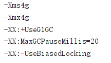
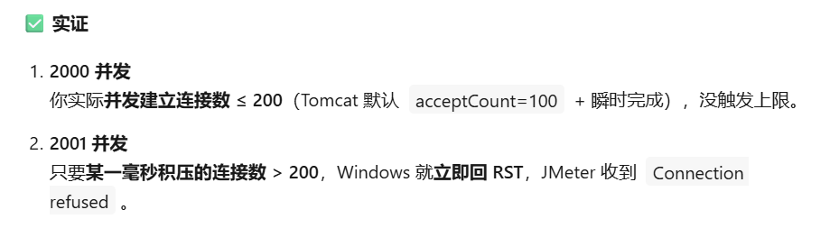

遇到的问题

1. 并发量太大时服务器会拒接访问：异常率 30%~70%
   - 通过增加 nginx 的最大连接数量缓解
   - 通过直接访问后端发现不是 nginx 的问题
   - spring 默认使用的容器是 tomcat，尝试配置更多的线程。结果然并卵

- 最后发现其实是 cpu 瓶颈了

1. 即使发现是 cpu 瓶颈也能继续尝试

   1. 把垃圾回收模式改为 G1：异常率 20%~60%

      ```
      -XX:+UseG1GC

      ```

   2. 设置 G1 收集器的最大停顿时间目标

      ```
      -XX:MaxGCPauseMillis=50

      ```

      - 设置 20 时稳定在 43%
      - 设置 10 时在 30~50 之间，qps 在 900~1200
      - 设置 50 时在 50%~70%，qps600~1000
      - 经过多次不同数值测试，发现太不稳定
        
      - 最终这个参数达到 17%异常和 1700qps（只有一次）
      - 从 2000qps 就会出错到 2500 才会出错，也算是有提升

   3. 堆内存设置（根据服务器内存调整，建议至少 8GB）
      -Xms16g -Xmx16g  
      堆内存大小固定，避免动态扩容触发 GC

   4. 禁用偏向锁（高并发下偏向锁撤销会引发额外 GC）
      -XX:-UseBiasedLocking
      并未发现明显提升
   5. ZGC 和 Shenandoah 均不支持 jdk8

- 最终，我找到了罪魁祸首
  
